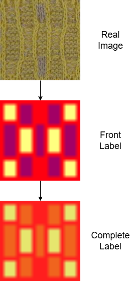
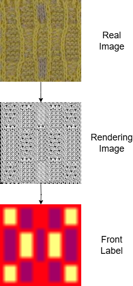
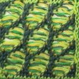
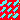
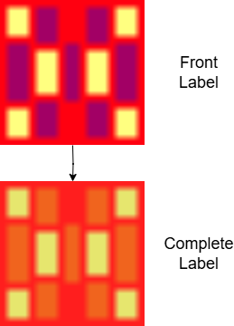

# Inverse Neural Knitting



This repository contains code for the paper **"Automated Knitting Instruction Generation from Fabric Images
Using Deep Learning"** (website).

## Installing dependencies
Scripts assume a Linux environment with Bash (Ubuntu 18.04.6).

The experimental environment was set up using Miniconda for dependency management and package installation. The following steps outline the configuration process, with all commands provided for reproducibility:

1. Install Miniconda

   ```
   wget https://repo.anaconda.com/miniconda/Miniconda3-latest-Linux-x86_64.sh
           bash Miniconda3-latest-Linux-x86_64.sh
           source ~/.bashrc
   ```

   

2. Create and Activate Python 3.6 Environment

   ```
   conda create -n tf1.11 python=3.6 
   conda activate tf1.11
   ```

3. Install GPU-Compatible TensorFlow and Dependencies

   Install TensorFlow 1.11 and its associated dependencies, ensuring compatibility with the RTX 2070 and CUDA 9.0

   ```
   conda install tensorflow-gpu=1.11.0
   conda install numpy=1.15.3
   conda install scipy=1.1.0
   ```

4. Install CUDA Toolkit and cuDNN

   ```
   conda install cudatoolkit=9.0 cudnn=7.1
   ```

5. Install Python Package Requirements

   Required Python packages were installed using the **requirements.txt** file provided in the project repository:

   ```
   pip install -r requirements.txt
   ```

6. Install ImageMagick for Image Processing

   ImageMagick was used for image manipulation during the preprocessing stage. The following commands were used:

   ```
   sudo apt update
   sudo apt install imagemagick
   sudo apt install zip unzip
   ```

7. Set Up Jupyter Notebook for Interactive Development

   Jupyter Notebook was installed to facilitate interactive code testing and experimentation:

   ```
   conda install jupyter
   jupyter notebook --ip=0.0.0.0 --no-browser
   ```

8. Install Additional Libraries

   For additional functionalities, the Scikit-learn library was installed:

   ```
   conda install scikit-learn
   ```

## Downloading dependencies

### Models
You will need to download the models:

```
./checkpoint.sh
```

`RFI_complex_a0.5`  and `RFINet_front_xferln_160k` is used for **Scenario 1** which focuses on Front Label Generation. `RFI_complex_a0.5` is Kaspar's model which used for baseline. `RFINet_front_xferln_160k` is our best Generation model.

All the model begin with `xfer_` is Inference model which focuses on Complete Label Inference. `xfer_complete_frompred_residual` is used for **Scenario 2**, which generates a complete label without prior knowledge of the input yarn. `xfer_complete_frompred_residual_mj` and `xfer_complete_frompred_residual_sj` are used for **Scenario 3**, distinguishing between single-yarn (sj) and multi-yarn (mj) categories. `xfer_complete_fromtrue_residual_mj` and `xfer_complete_fromtrue_residual_sj` are used for **Scenario 4**, directly uses ground truth front labels as input to produce complete labels, reducing dependency on the front label generation step.

For the refiner network, you will need to download vgg16 in the vgg model directory.

```
# download vgg16.npy and vgg19.npy
cd model/tensorflow_vgg/
./download.sh
```

### Datasets

You will need to download the dataset:

```
./dataset.sh
```

which gets extracted into the folder `dataset`.

## Front Label Generation

Obtain a front label from a real image. 



### Scenario 1: Unknown Front Label

#### Inference

Inference can be done with

```
./infer.sh -g 0 -c checkpoint/RFINet_front_xferln_160k ./inference_test/img1.jpg -o ./inference_test
```

where

* `-g 0` is to select GPU 0
* `-c checkpoint/RFINet_front_xferln_160k` is to use the selected model
* `img1.jpg` is an input image (can use a list of these)

This produces png outputs with same file names.

Results will saved in `./checkpoint/RFINet_front_xferln_160k/eval`.

**Input**



**Output**



**Scale detection**

At inference, you can specify the `-v` argument to output the average maximum softmax value of the output, which we use in the supplementary to automatically detect the best scale.
For example:

```
./infer.sh -g 0 -c checkpoint/RFINet_front_xferln_160k -v ./inference_test/img1.jpg
```

A sample output ends with
```
...
Generator variables: 1377359
 [*] Loading checkpoints...
checkpoint/RFINet_front_xferln_160k/_lr-0.0005_batch-2/FeedForwardNetworks-160000
 [*] Load SUCCESS
1 input-img1 (conf: m=0.840968, s=0.174491)

Processing Done!
```

where for each image of the list `m` is the mean confidence, and `s` the standard deviation.

#### Test

```
python main.py --checkpoint_dir=./checkpoint/RFINet_front_xferln_160k --training=False
```

Results will also saved in `./checkpoint/RFINet_front_xferln_160k/eval`.

#### Train

You should make sure you have downloaded the dataset. You also probably want to download the vgg npy files (see dependencies).

The training script goes through `run.sh` which passes further parameters to `main.py`.
For example, to train the RFI network:

```
./run.sh -g 0 -c ./checkpoint/RFINet_front_xferln_160k --learning_rate 0.0005 --params discr_img=1,bvggloss=1,gen_passes=1,bloss_unsup=0,decay_steps=50000,decay_rate=0.3,bunet_test=3,use_tran=0,augment=0,bMILloss=0 --weights loss_D*=1.0,loss_G*=0.2 --max_iter 160000
```

The code has many different types of network architectures that we tried (and some may or may not make sense anymore).
See the code to figure out what parameters can be tuned, notably see `model/m_feedforw.py` -- the file where the network decision are made for training and testing.

**Note**: the `-c` parameter is a directory path for the named checkpoint. You can / should use your own for training.
The only time it really matters is for inference, when the checkpoint must exist.

## Complete Label Generation



### Scenario 2: Unknown Yarn Type

Obtain a complete label from a real image without prior knowledge of its sj/mj classification.

#### Inference

```
python xfernet.py inference --checkpoint_dir ./checkpoint/xfer_complete_frompred_residual --model_type residual --dataset default --input_source frompred --input ./inference_test/img1.png --output ./inference_test/img1_s2p.png
```

#### Test

```
python xfernet.py test --checkpoint_dir ./checkpoint/xfer_complete_frompred_residual --model_type residual --dataset default --input_source frompred
```

#### Train

```
python xfernet.py train --checkpoint_dir ./checkpoint/xfer_complete_frompred_residual --model_type residual --dataset default --input_source frompred
```

### Scenario 3: Known Yarn Type

Obtain a complete label with knowledge of the sj/mj classification of the input image.

#### Inference

    python xfernet.py inference --checkpoint_dir ./checkpoint/xfer_complete_frompred_residual_sj --model_type residual --dataset sj --input_source frompred --input ./inference_test/img1.png --output ./inference_test/img1_s3sjp.png
or

```
python xfernet.py inference --checkpoint_dir ./checkpoint/xfer_complete_frompred_residual_mj --model_type residual --dataset mj --input_source frompred --input ./inference_test/img1.png --output ./inference_test/img1_s3mjp.png
```

#### Test

```
python xfernet.py test --checkpoint_dir ./checkpoint/xfer_complete_frompred_residual_sj --model_type residual --dataset sj --input_source frompred
```

or 

```
python xfernet.py test --checkpoint_dir ./checkpoint/xfer_complete_frompred_residual_mj --model_type residual --dataset mj --input_source frompred
```

#### Train

```
python xfernet.py test --checkpoint_dir ./checkpoint/xfer_complete_frompred_residual_sj --model_type residual --dataset sj --input_source frompred
```

or

```
python xfernet.py test --checkpoint_dir ./checkpoint/xfer_complete_frompred_residual_mj --model_type residual --dataset mj --input_source frompred
```

### Scenario 4: Using Ground Truth Front Label

Generate complete labels using a ground truth front label and knowledge of yarn type.

#### Inference

    python xfernet.py inference --checkpoint_dir ./checkpoint/xfer_complete_fromtrue_residual_sj --model_type residual --dataset sj --input_source fromtrue --input ./inference_test/img1.png --output ./inference_test/img1_s3sjt.png

or

```
python xfernet.py inference --checkpoint_dir ./checkpoint/xfer_complete_fromtrue_residual_mj --model_type residual --dataset mj --input_source fromtrue --input ./inference_test/img1.png --output ./inference_test/img1_s3mjt.png
```

#### Test

```
python xfernet.py test --checkpoint_dir ./checkpoint/xfer_complete_fromtrue_residual_sj --model_type residual --dataset sj --input_source fromtrue
```

or 

```
python xfernet.py test --checkpoint_dir ./checkpoint/xfer_complete_fromtrue_residual_mj --model_type residual --dataset mj --input_source fromtrue
```

#### Train

```
python xfernet.py test --checkpoint_dir ./checkpoint/xfer_complete_fromtrue_residual_sj --model_type residual --dataset sj --input_source fromtrue
```

or

```
python xfernet.py test --checkpoint_dir ./checkpoint/xfer_complete_fromtrue_residual_mj --model_type residual --dataset mj --input_source fromtrue
```

## References

If you use this code or system, please cite our paper:

```
@article{sheng2025,
  author = {H. Sheng and S. Cai and X. Zheng and M. Lau},
  title = {Knitting robots: A deep learning approach for reverse-engineering fabric patterns},
  journal = {Electronics},
  volume = {14},
  number = {8},
  pages = {1605},
  year = {2025},
  month = {Apr.},
  doi = {10.3390/electronics14081605}
}
```
