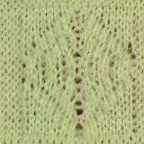
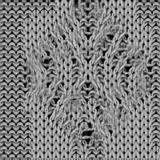

# Inverse Neural Knitting


This repository contains code for the paper **"Automated Knitting Instruction Generation from Fabric Images
Using Deep Learning"** (website).

## Installing dependencies
Scripts assume a Linux environment with Bash (Ubuntu 18.04.6).

The experimental environment was set up using Miniconda for dependency management and package installation. The following steps outline the configuration process, with all commands provided for reproducibility:

1. Install Miniconda

   ```
   wget https://repo.anaconda.com/miniconda/Miniconda3-latest-Linux-x86_64.sh
           bash Miniconda3-latest-Linux-x86_64.sh
           source ~/.bashrc
   ```

   

2. Create and Activate Python 3.6 Environment

   ```
   conda create -n tf1.11 python=3.6 
   conda activate tf1.11
   ```

3. Install GPU-Compatible TensorFlow and Dependencies

   Install TensorFlow 1.11 and its associated dependencies, ensuring compatibility with the RTX 2070 and CUDA 9.0

   ```
   conda install tensorflow-gpu=1.11.0
   conda install numpy=1.15.3
   conda install scipy=1.1.0
   ```

4. Install CUDA Toolkit and cuDNN

   ```
   conda install cudatoolkit=9.0 cudnn=7.1
   ```

5. Install Python Package Requirements

   Required Python packages were installed using the **requirements.txt** file provided in the project repository:

   ```
   pip install -r requirements.txt
   ```

6. Install ImageMagick for Image Processing

   ImageMagick was used for image manipulation during the preprocessing stage. The following commands were used:

   ```
           sudo apt update
           sudo apt install imagemagick
           sudo apt install zip unzip
   ```

7. Set Up Jupyter Notebook for Interactive Development

   Jupyter Notebook was installed to facilitate interactive code testing and experimentation:

   ```
   conda install jupyter
   jupyter notebook --ip=0.0.0.0 --no-browser
   ```

8. Install Additional Libraries

   For additional functionalities, the Scikit-learn library was installed:

   ```
   conda install scikit-learn
   ```

## Downloading dependencies

### Models
You will need to download the models:

```
./checkpoint.sh
```

`RFI_complex_a0.5`  and `RFINet_front_xferln_160k` is used for **Scenario 1** which focuses on Front Label Generation. `RFI_complex_a0.5` is Kaspar's model which used for baseline. `RFINet_front_xferln_160k` is our best Generation model.

All the model begin with `xfer_` is Inference model which focuses on Complete Label Inference. `xfer_complete_frompred_residual` is used for **Scenario 2**, which generates a complete label without prior knowledge of the input yarn. `xfer_complete_frompred_residual_mj` and `xfer_complete_frompred_residual_sj` are used for **Scenario 3**, distinguishing between single-yarn (sj) and multi-yarn (mj) categories. `xfer_complete_fromtrue_residual_mj` and `xfer_complete_fromtrue_residual_sj` are used for **Scenario 4**, directly uses ground truth front labels as input to produce complete labels, reducing dependency on the front label generation step.

For the refiner network, you will need to download vgg16 in the vgg model directory.

```
# download vgg16.npy and vgg19.npy
cd model/tensorflow_vgg/
./download.sh
```

### Datasets

You will need to download the dataset:

```
./dataset.sh
```

which gets extracted into the folder `dataset`.


## Inference

Inference can be done with

```
./infer.sh -g 0 -c path_to/RFI-complex-a0.5 img1.jpg [img2.jpg ...]
```

where

* `-g 0` is to select GPU 0
* `-c checkpoint/RFI-complex-a0.5` is to use the selected model
* `img1.jpg` is an input image (can use a list of these)

This produces png outputs with same file names.

**Input**



**Output**


### Scale detection

At inference, you can specify the `-v` argument to output the average maximum softmax value of the output, which we use in the supplementary to automatically detect the best scale.
For example:

```
./infer.sh -g 0 -c checkpoint/RFI_complex_a0.5 -v img1.jpg
```

A sample output ends with
```
...
Generator variables: 1377554
 [*] Loading checkpoints...
 checkpoint/RFI_complex_a0.5/_lr-0.0005_batch-2/FeedForwardNetworks-150000
  [*] Load SUCCESS
  1 input-img (conf: m=0.767297, s=0.186642)

  Processing Done!
```

where for each image of the list `m` is the mean confidence, and `s` the standard deviation.

### Rendering programs

The repository ships with a pre-trained renderer simulating what the proprietary renderer does.
This is a simple image translation network trained using the mapping from instructions to renderings.

You can render a pattern instruction with

```
CUDA_VISIBLE_DEVICES="0" python3 ./render.py myprog.png [prog2.png ...]
```

where 

* `--output_dir=path_to_dir` can be used to specify the output directory
* `CUDA_VISIBLE_DEVICES=0` is to select the first GPU only
* `myprog.png` is a program output (from `infer.sh`), or a list of these

**Input**


**Output**



### Visualizing programs

We provide a visualization script to make program outputs more easily interpretable.

```
python3 ./test/visualize.py myprog.png [prog2.png ...]
```

will generate files `${file}_viz.png` using the same symbols and colors as shown in the paper.

**Input**


**Output**


## Training from scratch

You should make sure you have downloaded the dataset. You also probably want to download the vgg npy files (see dependencies).

The training script goes through `run.sh` which passes further parameters to `main.py`.
For example, to train the complex RFI network:

```
./run.sh -g 0 -c checkpoint/RFINet_complexnet --learning_rate 0.0005 --params discr_img=1,bvggloss=1,gen_passes=1,bloss_unsup=0,decay_steps=50000,decay_rate=0.3,bunet_test=3 --weights loss_D*=1.0,loss_G*=0.2
```

For the base `img2prog` network, use

```
./run.sh -g 0 -c checkpoint/img2prog --params use_resnet=1,use_rend=0,use_tran=0
```

The code has many different types of network architectures that we tried (and some may or may not make sense anymore).
See the code to figure out what parameters can be tuned, notably see `model/m_feedforw.py` -- the file where the network decision are made for training and testing.

**Note**: the `-c` parameter is a directory path for the named checkpoint. You can / should use your own for training.
The only time it really matters is for inference, when the checkpoint must exist.

## Testing

The test scripts are in `test`.
They require the dataset.

Given a checkpoint, you can create the evaluation data for that checkpoint with `test/eval_checkpoint.sh`.
The test inference results will be generated in a subdirectory `eval` of the checkpoint directory.
Then, these will be used to create renderings and be copied together in the result folders with the checkpoint name.

To create the ground truth results, use
```
./test/results/create_gt.sh
```

## References

If you use this code or system, please cite our paper:

```
@InProceedings{pmlr-v97-kaspar19a,
  title =   {Neural Inverse Knitting: From Images to Manufacturing Instructions},
  author =  {Kaspar, Alexandre and Oh, Tae-Hyun and Makatura, Liane and Kellnhofer, Petr and Matusik, Wojciech},
  booktitle = {Proceedings of the 36th International Conference on Machine Learning},
  pages =   {3272--3281},
  year =    {2019},
  editor =  {Chaudhuri, Kamalika and Salakhutdinov, Ruslan},
  volume =  {97},
  series =  {Proceedings of Machine Learning Research},
  address = {Long Beach, California, USA},
  month =   {09--15 Jun},
  publisher = {PMLR},
  pdf =     {http://proceedings.mlr.press/v97/kaspar19a/kaspar19a.pdf},
  url =     {http://proceedings.mlr.press/v97/kaspar19a.html},
}
```
